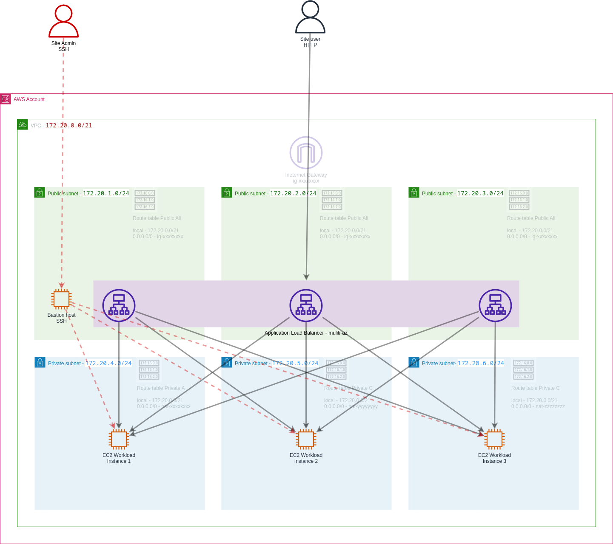
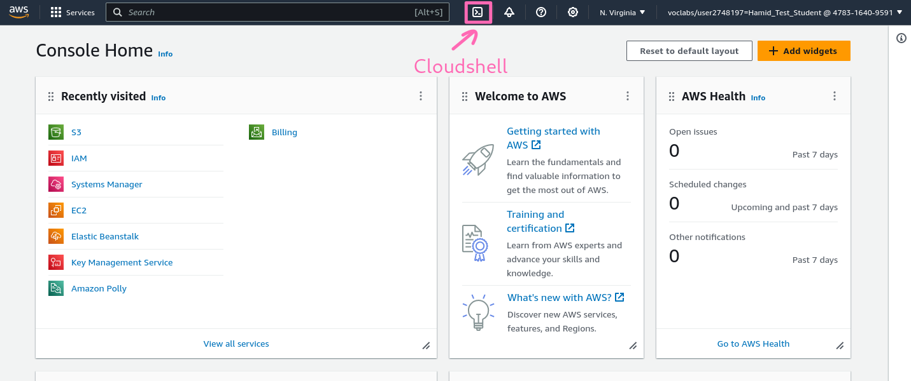
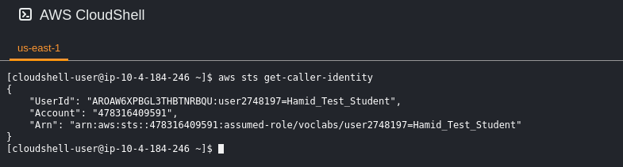
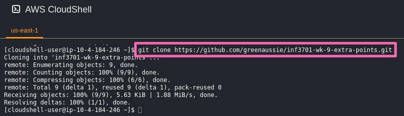

# Introduction to Infrastructure As Code in AWS - Lab

## Overview

The learning objectives of this lab are:

1. Introduce infrastructure as code (IaC)
2. Demonstrate how to use AWS CloudFormation to deploy infrastructure
3. Demonstrate how to use AWS CloudShell as a command line tool within an AWS Account
4. Using scripts to create repeatable steps to carry out the deployment
5. Update the template to demonstrate how to horizontally scale the application resources

Infrastructure As Code (IaC) is a way of describing the infrastructure you want to build in a declarative way, and then having a tool build it for you. The tool is usually a command line tool, but can also be a web based tool.

The tool we have chosen to use is [AWS CloudFormation](https://aws.amazon.com/cloudformation/). CloudFormation is a declarative language for describing AWS infrastructure. It is a very powerful tool, and can be used to build almost any AWS infrastructure.

The template `/home/richard/github/greenaussie/inf3701-wk-9-extra-points/cloudformation-templates/infrastructure.yml` is an example of a CloudFormation template. It describes the following infrastructure, whose resources have been covered in the course INF3701. This is a diagram of the infrastructure:



The infrastructure consists of a number of resources including:

- A VPC
- Three public subnets, one in each availability zone
- Three private subnets, one in each availability zone
- A route table for the public subnets
- A route table for the private subnets of each availability zone
- An internet gateway
- A NAT gateway in each availability zone
- A security group for the EC2 instances
- A security group for the Application Load Balancer
- An Application Load Balancer
- A target group for the Application Load Balancer
- Three EC2 instances, one in each private subnet
- A bastion host in the public subnet of the first availability zone

Stack outputs are used to obtain the website URL, and the bastion host IP address.

Various supporting scripts are provided to deploy the CloudFormation stack, and to delete it. The scripts are in the `scripts` directory. The scripts are numbered to indicate the order in which they should be executed. The scripts are:

- `scripts/010-deploy.sh` - Deploy the CloudFormation stack
- `scripts/020-start-ssh-agent-in-cloudshell.sh` - Start the ssh-agent
- `scripts/030-ssh-to-bastion-host.sh` - SSH to the bastion host
- `scripts/099-delete.sh` - Delete the CloudFormation stack

## Deploying the AWS Cloudformation Stack

A collection of AWS Resources is called a stack. The resources typically have dependencies on each other, and CloudFormation will build them in the correct order. For example, you cannot build a subnet without first building a VPC, and you cannot build an EC2 instance until you have built a subnet and the security group for the EC2 instance.

There are various ways to deploy the templates. Here, we will use the AWS CLI. The AWS CLI is a command line tool for interacting with AWS. It is a very powerful tool, and can be used to do almost anything in AWS.

Within you **[AWS Acadamy learner AWS account](https://www.awsacademy.com/)**, we will use AWS CloudShell to copy the resources from GitHub to your AWS account.

### Copy the resources from GitHub to your AWS account

> As usual, we will work from the **N. Virgina** (us-east-1) region. Make sure you are in the **N. Virgina** region by selecting it from the drop down menu in the top right of the AWS Console.

Open the AWS CloudShell by clicking on the icon in the top right of the AWS Console. It looks like this:



Open the template and the diagram next to each other in separate tabs or Windows, so you can see how the template describes the infrastructure.

Notice that the AWS CloudShell is a Linux command line. You can type commands into it, and it will execute them for you. Addtionally it has a number of tools pre-installed, including the AWS CLI, and it has an IAM role attached to it which gives it permissions to do things in your AWS account.

We can show the IAM role attached to the AWS CloudShell by typing the following command:

```bash
aws sts get-caller-identity
```



On the command line, clone the GitHub repository containing the resources for this lab:

```bash
git clone https://github.com/greenaussie/inf3701-wk-9-extra-points.git
```



We can see the files have copied with a command such as this:

```bash
ls -lR inf3701-wk-9-extra-points
```

### Deploy the CloudFormation stack (1 mark)

Change your working directory to the directory containing the resources for this lab:

```bash
cd inf3701-wk-9-extra-points
```
> Usually with CLI we carry out actions from the top level of the Git project directly.

Take a minute to observe how we iteratively develop infrastrucure. We start with a simple template, and then we add more resources to it. We can then deploy the template, and see the resources being created in the AWS Console. We can then make changes to the template, and re-deploy it. We can see the changes being made to the infrastructure. 

```bash
git log --name-status
```

View the deployment script, `scripts/010-deploy.sh`. It is a bash script which will deploy the CloudFormation template. It is a simple script, but it is a good idea to look at it to understand what it is doing.

```bash
cat scripts/010-deploy.sh
```

You can see commands which could be executed from the command line. However is we write a script to execute the command for us, it means we can more easily repeat a command, and, once we have tested it, we can be more confident that it will work the same way each time.

Deploy the CloudFormation stack by executing the script:

```bash
scripts/010-deploy.sh
```

While the stack is being deployed, you can view the progress in the AWS Console. Go to the CloudFormation service, and click on the stack. You will see the status of the stack change from `CREATE_IN_PROGRESS` to `CREATE_COMPLETE`.

> You may see other stacks which have already been deployed. These are stacks which have been deployed to prepare the learner environment.

Once the stack has been created, you can view the resources which have been created. You can see the VPC, the subnets, the route tables, the internet gateway, the NAT gateway, the security groups, and the EC2 instances.

The website address is shown in the Outputs tab. Click on the link to view the website. You will see a simple web page, which is being served by the one of the three EC2 instances. Running multiple instances allows us to distribute the load across multiple instances, and also provides redundancy in case one of the instances fails

> The website is not served over HTTPS. This is because we have not configured a certificate for the website. For a production website, we would configure a certificate, and serve the website over HTTPS.

**To gain the marking points for this lab, you must show the tutor that you have deployed the CloudFormation stack, and that you can view the website.**


### View the website

The new website URL is accessed through the Application Load Balancer.

The website URL is available as an output from the CloudFormation stack. You can view the outputs by selecting the stack in the AWS Console, and clicking on the Outputs tab.


### Challenge (1 extra mark) - horizontally scale the application resources

> The term Horizontal Scaling refers to adding more resources to a system, such as adding more EC2 instances to a web server. This is in contrast to Vertical Scaling, which refers to adding more resources to an existing resource, such as adding more memory to an EC2 instance.

To gain one extra mark, you can complete the following challenge:

Update the cloudformation template to deploy a an additional EC2 instance in each availablity zone. 

- The new EC2 instances should be added as additional targets within the target goups.
- Re-deploy the stack to create the new EC2 instances

To update the template you can use a CLI editor within CloudShell, which is called `nano`. You can open the template with the following command:

```bash
nano cloudformation-templates/infrastructure.yml
```

You can navigate around the template within `nano` using the arrow keys. You can edit the template, and save it with the changes, by using the ket combinations which are displayed at the bottom of the editor's work area.


**To gain the extra mark, you must show the tutor that you have deployed the additional EC2 instances and they are attached to the target group:**

```bash
aws elasticloadbalancingv2 describe-target-health --target-group-arn arn:aws:elasticloadbalancing:ap-southeast-2:123456789012:targetgroup/INF3701-Web-TargetGroup/1234567890123456
```


### Delete the CloudFormation stack

> **Important:** Your sandbox AWS account will be charged for the resources which are created by the CloudFormation stack. Make sure you delete the resources when you have finished with them.

Once you have finished with the stack, you can delete it. This will delete all the resources which were created by the stack.

Delete the stack by executing the script:

```bash
scripts/099-delete.sh
```
Alternatively you can select the stack in the AWS Console, and click the Delete button.

